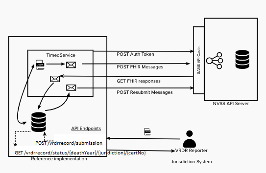

# Reference Client API
A reference implementation for jurisdications that retrieves json from a database and uses the vrdr-dotnet library to create vrdr records and wrap it in a message to submit to the NCHS API.

## Architecture Diagram 
  

### Architecture Description
The VRDR reporter inserts a new JSON vrdr record into the db. The reference implementation pulls any new messages, converts the json to a VRDR record, wraps it in a message, and POSTs the message to NCHS API. The reference API makes a GET request for any new messages. It updates the database with the new message status. Finally, it checks for any messages that have not received a message in X amount of time and resubmits them. The service runs all of these steps in sequece every X number of seconds. The frequency is configurable.

TODO add description of how the library helps implement this.

TODO use docker compose, db migrations

TODO Configuration, server address, credentials

# Functions 
- TODO Pull new records from the database
- Submit to api  
- Check for responses from the server - implemented with timer, 
- TODO retry sending message that haven't had an responses in x time

- TODO send an ack when you get a coding response or extraction error
- single timer that calls all 3 in order
- check for responses before resending messages

- do they want to see all responses over time
- DBs: different dbs will have different implementations, keep queries generic and they could swap one to another? would we need to list out what we use? use adapters

# Use Cases
- demo use case
- reference use case
- recommendations for dashboards


# Setup
1. Setup the database docker containers
    a. Run `docker-compose up --build` to initialize the client db (postgres) and the server db (mssql)
    b. exec into the postgres container, and initialize the database with the init.sql script
    `cd /home`
    `psql -U postgres -f init.sql`
    exit the container
    c. Populate the postgres db with test data
    ```
    cd test-files
    python3 setup_db.py
    ```
    d. If you have your own test files, add them to the test-files/ folders before running the setup script  

    e. To check the postgres db has records, run
    ```
    python3 read_data.py
    ```
    TODO Think of ways to pull in large amounts of test data and to add in data periodically/on command
2. Run the NCHS api server by following the README https://gitlab.mitre.org/nightingale/reference-nchs-api   
    a. skip the docker command, already accomplished in step 1
    d. exit the container and from the reference-nchs-api project directory run `dotnet ef database update`
    e. run the api server with `dotnet run`
3.  Now that the client db, server db, and the api server are all up and running, from the reference-client-api project root directory run
    ```
    dotnet run
    ```
# New Setup
1. Setup the database docker containers
    a. Run `docker-compose up --build` to initialize the client db (postgres) and the server db (mssql)
    b. Run `dotnet ef migrations add InitialDb` to initialize `dotnet ef database update` TODO update , had to comment out section that adds the timed service?
    c. Populate the postgres db with test data
    ```
    cd test-files
    python3 setup_db.py
    ```
2. Run the NCHS api server by following the README https://gitlab.mitre.org/nightingale/reference-nchs-api   
    a. skip the docker command, already accomplished in step 1
    d. exit the container and from the reference-nchs-api project directory run `dotnet ef database update`
    e. run the api server with `dotnet run`
3.  Now that the client db, server db, and the api server are all up and running, from the reference-client-api project root directory run
    ```
    dotnet run
    ```

Down the road questions
- What state will they want to keep track of? If they use a native format, they will have two versions of the same record
- Potential adapter for handling different formats?

Timeline:
- Have something solid when the api is deployed at NCHS, be able to submit messages for testing
- Demo to Rajesh and co, what do we need to authenticate to the server once its up
    - could test the authentication ahead of time
    - Last week of september